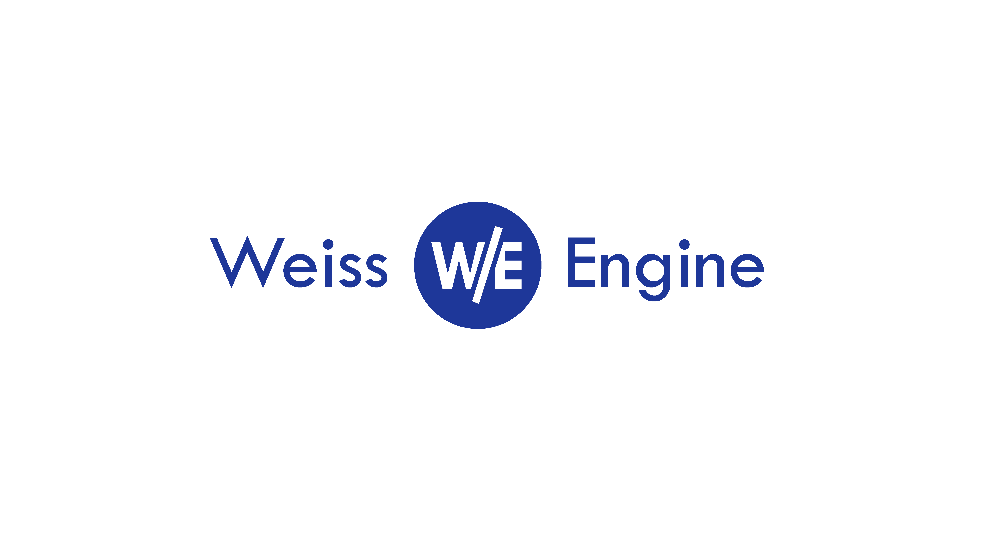

# Weiss

> Weiss is a computer graphics, audio & networking engine built with c++17 that strives to make the development of 2D & 3D interactive applications simpler and faster

For Informations about Weiss' contents & Building Instructions, please refer to [docs/README.md](docs/README.md).
